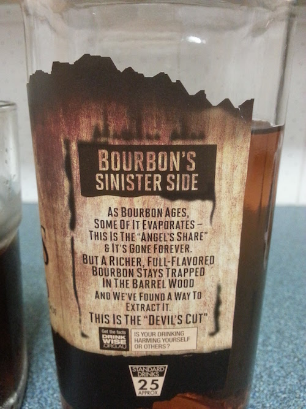
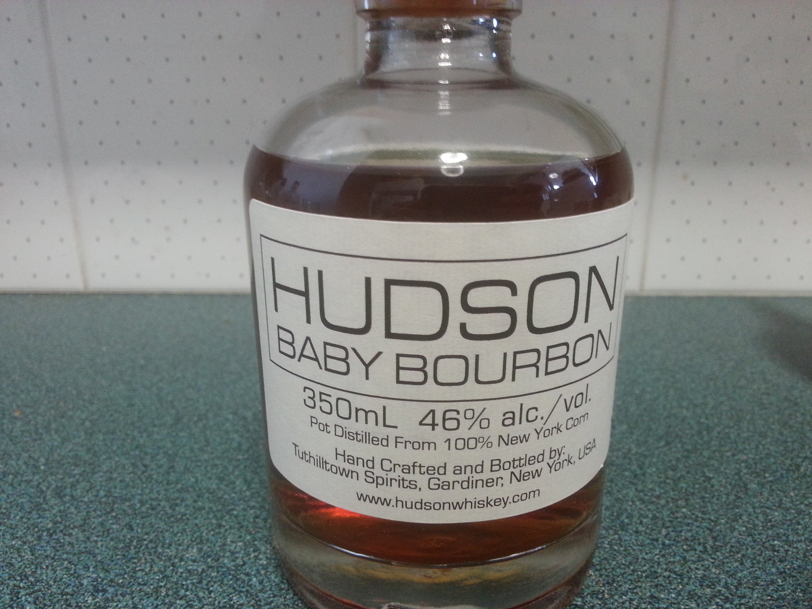

# The Bourbon Bucket List

All things Bourbon....a bit about Kentucky.

The tales of Wild Turkey hunting and son's named Beam are famous all around the world and especially in my home.

Bourbon is mostly made from corn and dates back to the 1820's and is legendary in Kentucky.

## Jim Beam Devil's Cut

I bought this bottle for $43 AUD and the image below is what's printed on the side.

## Hudson Baby Bourbon

For $55 AUD, Hudson Baby Bourbon 350ml is exceptional.

